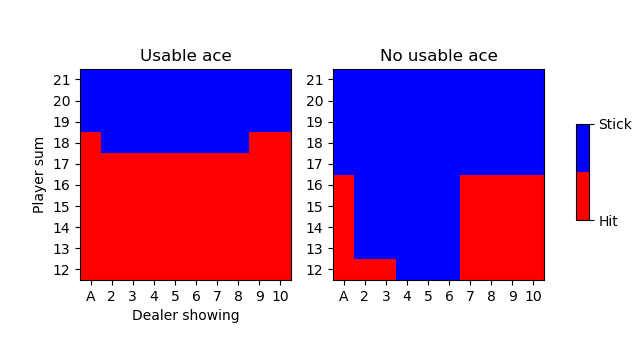

# Monte Carlo Methods

This is a python implementation of a reinforcement learning agent that solves a version of blackjack using a monte carlo method. For more information check out my blog article about monte carlo methods https://cfml.se/blog/monte_carlo_methods/.
